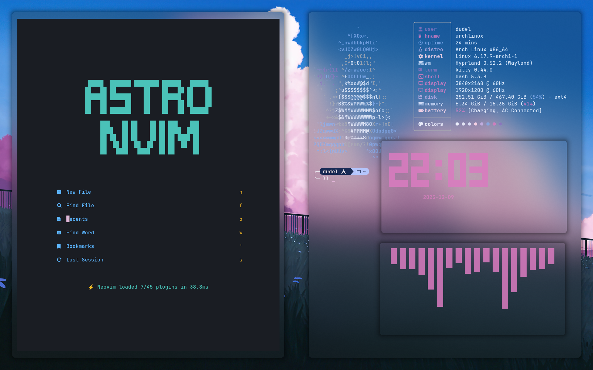
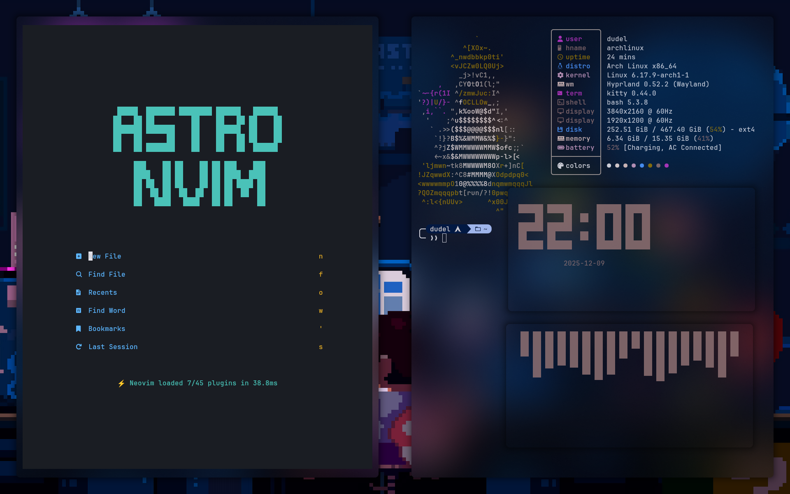

# 🍚 My Dotfiles

Small collection of my personal configs.  
Based on **https://github.com/mylinuxforwork**

## 🖥️ Setup
- Hyprland (Wayland)
- Kitty terminal
- Bash
- Waybar
- Rofi
- Neovim (AstroNvim)
- JetBrains IDEs
- Fastfetch for system info

## 📸 Screenshot

